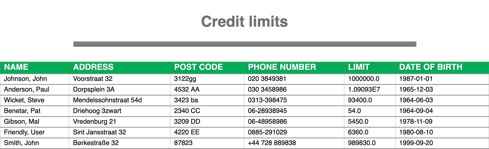

# Objective

As the task is relatively simple, the objective is accomplished as a command line utility and not a web-application. Also, no fancy frameworks like akka are used. I've also opted out from using common approaches like a type-class pattern as it'd be an overkill for this task.

## Instruction to run the project

Go to the root of the project and issue the command 
`$ sbt clean compile test package publishLocal run`

One would be asked to choose which file to process. Make your choice and the program would specify the path of the HTML file containing input file's data.
### Result

## Remarks

- **PRN format**: Requirements for the PRN file format is unclear to me. As far as my understanding goes, (from searching for this format online) it's a text file created by the Lotus 1-2-3 spreadsheet software;
[which is tab delimited according to IBM](https://www.ibm.com/support/knowledgecenter/en/SSPN2D_10.2.1/com.ibm.swg.im.cognos.cp_a.10.2.1.doc/cp_a_id71792DefineColumnsinanASCIIFile.html "It's tab delimited according to IBM"). Please also look at the [information from Microsoft on PRN file.](https://docs.microsoft.com/en-us/office/troubleshoot/excel/prn-file-limited-to-240-characters
 "information from Microsoft on PRN file.") As the provided file wasn't tab delimited with UTF-8 encoding, I have chosen to fix it into a tab delimited file with UTF-8 encoding.
- It was a design choice for just this occasion to not use a class with constructor parameters; which would have probably meant mocking dependencies when assembled and delegated.  
